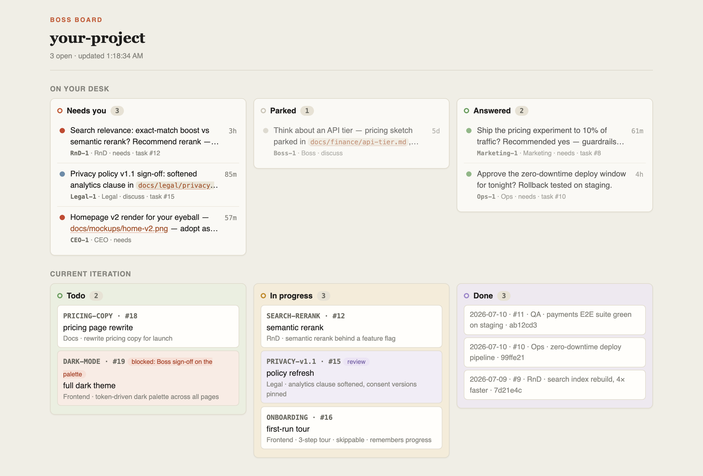
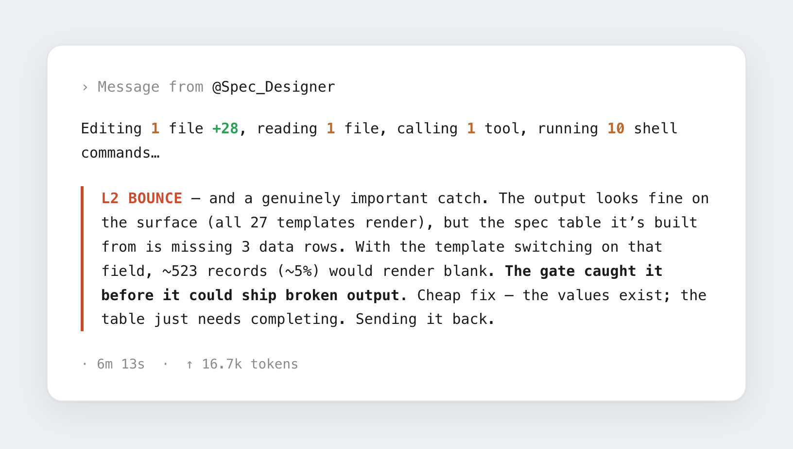
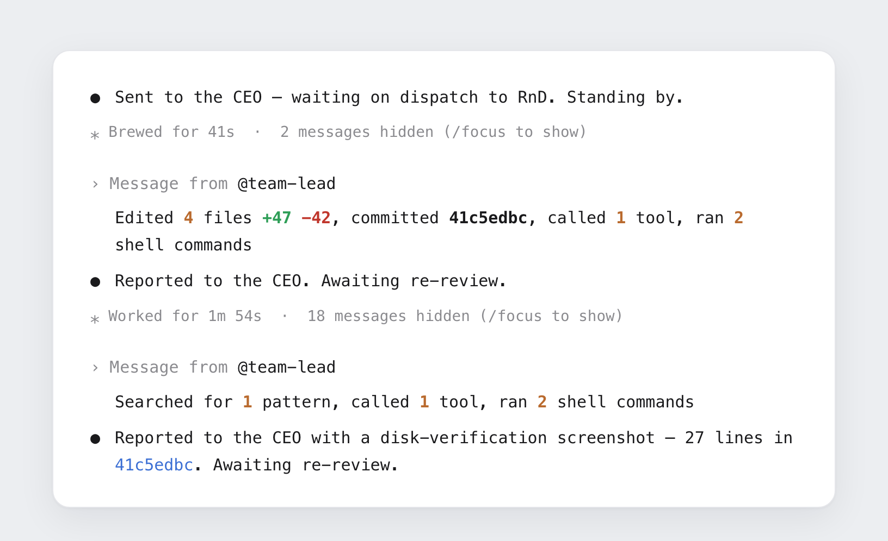
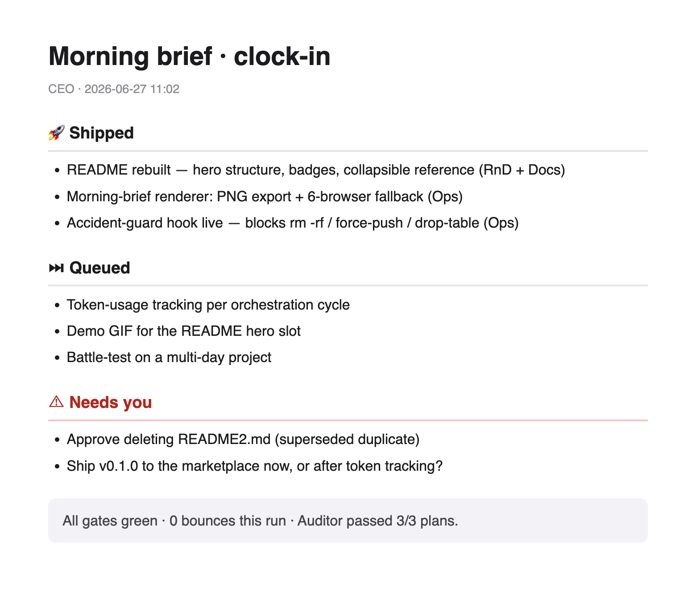

<!-- Language switcher — restore once README.zh-CN.md is published:
     <div align="right"><strong>English</strong> · <a href="README.zh-CN.md">中文</a></div> -->

<!-- Drop a logo here when you have one: <p align="center"></p> -->

<div align="center">

# clock-in

**Run your Claude Code session like a company you own.**

A manager that plans, specialists that build, an independent reviewer that signs off
before anything counts as done, and one live board where everything that needs *you* shows up.

[](CHANGELOG.md)
[](https://docs.claude.com/en/docs/claude-code)
[](#youll-need)
[](LICENSE)
[](#feedback)

</div>

<p align="center">
  
</p>
<p align="center"><sub>The Boss Board: every question waiting on <em>your</em> call, with the context to decide it, above a live view of the current iteration. It opens itself, updates itself, and never lets a thread sink. Every file path on it is a link.</sub></p>

---

## What it does

- **Makes "done" mean done.** Nothing is marked finished until an independent reviewer has approved the plan *and* the result. Quality comes from the structure, not from one model marking its own homework.
- **Puts everything that needs you in one place.** Asks land on the Boss Board with what you need to decide on the spot: the question, the options, a recommendation. Any file an ask mentions is one click away, so a "your eyeball on this render" ask opens the render itself, even when it only exists in a teammate's worktree before merge. Nothing scrolls past you mid-transcript.
- **Stops stuck work early.** A task that keeps bouncing gets pulled out of the rework loop and diagnosed; if it's still stuck after that, it comes to you as a decision, not a surprise.
- **Keeps a shared memory.** Decisions and settled answers are written where every teammate reads them, so nothing settled gets re-litigated or quietly contradicted as the project grows.
- **Watches the watchers.** An independent inspector audits the whole team, including the manager, and answers only to you.
- **Spends smart models on judgment, cheap models on typing.** The manager and department heads run on Opus; the staff they spawn run on Sonnet, or Haiku for pure grunt work.
- **Catches destructive commands.** Force-pushes, recursive deletes and dropped tables are intercepted before they run.
- **Stays fast on long projects.** Only what matters stays in view; the rest lives on disk. Long runs don't bog down or lose the plot.

<p align="center">
  
</p>
<p align="center"><sub>The reviewer earning its keep: a defect caught and bounced <em>before it merged</em>.</sub></p>

---

## The company

You're the Boss. Your Claude Code session becomes the **manager**: it breaks your goal into tasks and hands each to a **specialist** (engineering, testing, ops, legal, finance, docs, whatever the work needs). An independent **reviewer** clears every plan before work starts and every result before it ships. An **inspector** oversees the whole operation, including the manager, and reports straight to you.

Most "multi-agent" tools are one prompt wearing different hats. clock-in is built on **separation of powers**: the roles genuinely check each other, and the checks fire on their own; they don't depend on anyone remembering to ask.

> [!NOTE]
> clock-in thinks bilingually: some roles carry Chinese names and the workflow has a Chinese shorthand. You never need to read them; everything works in plain English. Flavour, not a requirement.

---

## Working with it

Say what you want, in plain words. The manager drafts a plan and runs it past you; once you're happy, the specialists build while checking each other's output, and you get a short, clear report of what changed.

<p align="center">
  
</p>
<p align="center"><sub>The team in motion: specialists report up, and every result waits on an independent check before it counts.</sub></p>

You're never boxed out. Founder mode means you can drop in on any specialist directly, hash something out, and the manager gets caught up afterwards. Full control, even when the work outgrows what you could hold in your head.

Leave it running overnight and you come back to a one-glance summary of **what shipped, what's queued, and what needs your decision**, instead of an archaeology dig.

<p align="center">
  
</p>
<p align="center"><sub>Wake up to the state of the run (shipped · queued · needs-you) instead of scrolling back through the night.</sub></p>

---

## Quick start

### You'll need

- **Claude Code with Agent Teams enabled.** The whole thing runs on teammates.
- **Python 3.** Standard library only, nothing to `pip install`.
- **A git repo** (recommended). The team commits as it goes, so the history is always yours to check.

Turn on Agent Teams in your Claude Code `settings.json`:

```json
{ "env": { "CLAUDE_CODE_EXPERIMENTAL_AGENT_TEAMS": "1" } }
```

### Install

```text
/plugin marketplace add Lumos221/clock-in
/plugin install clock-in@mycompany
```

Then restart Claude Code. Everything wires itself up on enable; no extra setup.

### Start

Open a project and just say **"clocking in"** (or 「开始上班」). The first time, it sets up the team your project needs and asks for one restart so everything loads; after that it picks up right where you left off.

> [!TIP]
> **Skip it for small stuff.** A one-file tweak doesn't need a company; just ask Claude directly. clock-in earns its keep on multi-part work.

---

## Good to know

> [!WARNING]
> **Actively evolving.** It works (I use it daily), but expect rough edges.
>
> - The workflow is still being refined ([CHANGELOG](CHANGELOG.md) has the release-to-release story).
> - Not yet cost-measured: the brains/hands split keeps Opus off the boilerplate, but I haven't measured the actual saving. Mileage varies by plan.
> - Not yet battle-tested on very large, long-running projects.

---

## Why I built it

My thoughts are jumpy and bursty. I start more threads than I finish, and the ones I don't write down slip away, so I lean hard on structure outside my head. clock-in is that structure, applied to running AI agents: the checks, the shared memory, the one place where whatever needs me shows up.

Build for a mind that needs structure to stay on track, and you get something steadier for everyone.

---

## Feedback

A personal experiment, shared in the hope it helps someone and gets better with other eyes. **Issues and PRs are very welcome**, especially concrete reports of where it breaks down on real work.

## Credits

Inspired by [edict](https://github.com/cft0808/edict) (Tang-dynasty 三省六部 / six ministries) and [Paul Graham's founder mode](https://paulgraham.com/foundermode.html).

## License

[MIT](LICENSE) · Lumos, 2026.
